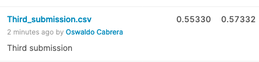

# Telstra Network Disruptions

Competencia [Kaggle Telstra Network Disruptions](https://www.kaggle.com/c/telstra-recruiting-network/overview)

## Entendimeinto del negocio

[Telstra](https://es.wikipedia.org/wiki/Telstra) es una empresa Australiana que ofrece servicios de telecominicaciones, es el mayor proveedor de telefonia local en el país, además ofrece servicios de telefonía móvil y acceso a internet.
El objetivo del problema es predecir si una falla en su servicio es una falla momentanea, una falla menor o una falla grave. Mediante este sistema Telstra intenta ofrecer una mejor experiencia a sus usuarios. 

Desde un punto de vista empírico estas fallas en la red de Telstra pueden ser ocacionadas por factores como: 
+ Un desastre natural.
+ Problema de hardware (falta de mantenimiento a los componentes).
+ Horario de la falla y el numero de usuarios conectados a la red.
+ Fallo de la energía eléctrica.

Para esto Telstra nos proporciana distintos [datasets](/data), los describiré a continuación: 

+ **train:** Contiene informacion sobre la severidad de la falla y la ubicación.
+ **test:** Conjunto de prueba, contiene ubicaciones donde han ocurrido fallas.
+ **event_type:** Tipo de evento, relacionado con cada falla en los conjuntos train y test.
+ **log_feature:** Características de cada falla, extrídas de los archivos de registro.
+ **resource_type:** Tipo de recurso relacionado con el conjunto de datos principal.
+ **severity_type:** Tipo de severidad de un mensaje de advertencia proveniente del registro.

## Comprensión de los datos y primer análisis

Se prosigue a analizar cada uno de los datasets proporcionados por Telstra. Este primer análisis se puede encntrar en [analisis_exploratorio](Analisis_exploratorio.ipynb)

[train.csv](data/train.csv):
*  **Tamaño:** 7381 filas, 3 columnas
*  **Valores nulos:** No
*  **Descripcion de las columnas:**
    - **id:** Identificador único asociado a cada falla.
    - **location:** Ubicación de falla, 929 ubicaciones diferentes.
    - **fault_severity:** Gravedad de la falla (variable a predecir).
        + **0:** falla momentanea o no hay falla.
        + **1:** falla menor o pocas fallas.
        + **2:** falla grave o muchas fallas.
        
 *  **Obervaciones:**
     + Problema de clasifiación multiclase, tenemos tres tipos de fallas a predecir [0, 1, 2].
     + Clases desbalanceadas: 
        - El 64.8% de las fallas registradas corresponden a la etiqueta 0.
        - El 25.3% de las fallas registradas corresponden a la etiqueta 1.
        - El 9.8% de los registros corresponden a la etiqueta 2.
 
[test.csv](data/test.csv):
*  **Tamaño:** 11,171 filas, 2 columnas
*  **Valores nulos:** No
*  **Descripcion de las columnas:**
    - **id:** Identificador único asociado a cada falla.
    - **location:** 1039 ubicaciones diferentes. 

 *  **Obervaciones:**
    + 18552 registros únicos en total (train.csv + test.csv)

[event_type.csv](data/event_type.csv):
*  **Tamaño:** 31170 filas, 2 columnas
*  **Valores nulos:** No
*  **Descripcion de las columnas:**
    - **id:** Identificador único asociado a cada falla.
    - **event_type:** Tipo de evento, 53 tipos diferentes.
    
*  **Obervaciones:**
    + Hay 31,170 registros, lo que indica que un id puede estar asociado a más de un evento diferente.
    
[log_feature.csv](data/log_feature.csv):
*  **Tamaño:** 58671 filas, 3 columnas
*  **Valores nulos:** No
*  **Descripcion de las columnas:**
    - **id:** Identificador único asociado a cada falla.
    - **log_feature:** 386 carácteristicas diferentes.
    - **volume:** Volumen, variable numérica.
    
*  **Obervaciones:**
    + Hay 58,671 registros, lo que indica que un id puede tener asociado más de una característca.

[resource_type.csv](data/resource_type.csv):
*  **Tamaño:** 21076 filas, 2 columnas
*  **Valores nulos:** No
*  **Descripcion de las columnas:**
    - **id:** Identificador único asociado a cada falla.
    - **resource_type:** 10 recursos diferentes.
    
*  **Obervaciones:**
    + Al igual que en event_type y en log_feature una falla (id) puede tener asociado mas de un recurso diferente.

[severity_type.csv](data/severity_type.csv):
*  **Tamaño:** 18552 filas, 2 columnas
*  **Valores nulos:** No
*  **Descripcion de las columnas:**
    - **id:** Identificador único asociado a cada falla.
    - **severity_type:** 5 tipos diferente.

# Procesamiento de datos

Esta parte del proceso puede consultarse en [Data_preprocessing](Data_preprocessing.ipynb).

Partiendo del análisis exploratorio, para los datasets log_feature, event_type, severity_type y resource_type se crearon columnas con cada una de las variables categóricas aplicando get_dummies() de pandas, la columna volume en log_feature es numérica por lo tanto se deja igual. Para location en train y test unicamente se aplicó label_encoder para codificar la variable categórica, para poder aplicar esta función se unieron ambos datasets ya que se se aplicaba por separado las ubicaciones no eran etiquetadas bajo el mismo criterio.

Train y test se mezclan por id con cada uno de los datasets creados con las demás características, esto da como resultado [train_completo.csv](train_completo.csv) y [test_completo.csv](test_completo.csv), train con una dimensión de (7381, 458) y test con una dimensión de (11171, 456).

# Prueba con distintos clasificadores

Esta parte del proceso se puede consultar en el notebook [Model_test](Model_test.ipynb)

Como primera estrategía a seguir se eligieron tres modelos clasificadores para probar el desempeño con los datasets generados, los modelos elegidos fueron Random Forest Classifer, K Nearest Neighbors, Suport Vector Classifier, Gradient Boosting Classifier. Con este primer análisis unicamente se buscaba evaluar el desempeño de cada modelo con la data. Se dividieron los datos de [train_completo](train_completo.csv) en una porcion de 80% para el entrenamiento y 20% para la validación. 

El modelo que tuvo mejor desempeño fue Gradient Boosting Classifier con una perdida logaritmica de 0.58 seguido de Suport Vector Classifier con 0.77 de perdida. Viendo este desempeño realicé mi primer subida a Kaggle y obtuve un score de 0.58.

Obteniendo la matriz de confusion, me percaté que el modelo predecia muy bien las fallas del tipo 0, mientras que las fallas del tipo 2 (las mas interesantes para telstra) no lo hacía bien. Esto se debe al desbalance que hay en las clases, este problema es típico cuando los datos presentan clases desbalanceadas.

# Gradient Boosting Classifier

Esta parte del proceso se puede consultar en el notebook [Model_selection](Model_selection.ipynb).

Para tratar de mejorar el desbalance que presentan las clases, se aplicó Oversampling para balancear la clase minoritaria, esta técnica consta de aumentar el numero de registros de las clases miniritarias a fin de equilibrarlas. El numero de registros pasó de 7381 a 14352 cada clase con el 33% de los registros. Se evaluó usar Undersampling, que es un método contrario, es decir que elimina aleatoriamente registros de la clase mayoritaria, al final solo se usó Oversamplig.

El desempeño de Gradient Boosting Classifier con clases balanceadas fue peor que el anterior con clases balancedas, obtuvo una mayor pérdida logarítmica (0.66). 

La estrategia a seguir fue mejorar el modelo variando el learning_rate y n_estimators, se analizó el rendimiento con learning_rate = [1, 0.75, 0.5, 0.25, 0.1, 0.05, 0.01] y n_estimators = [100, 200, 300, 400, 500, 600, 700, 800, 900, 1000]. Los paramétros learning_rate = 0.25 y n_estimators=400 son los que tuvieron mejor desempeño, log_loss = 0.56 para ambos.

Tratando de mejorar el desempeño del modelo, se obtuvieron las caracteríticas mas importantes y se volvió a entrenar unicámente con las 91 características que mas aportaban, con una selección de paramétros learning_rate=0.3 y n_estimators=400, el desempeño del modelo fue ligeramente peor teniendo una pérdida de 0.60. 

Finalmente el mejor desempeño se obtuvo con un n_estiamator=400 sin cambiar el learning_rate, este modelo tuvo la menor perdida que todos, 0.55. 

# Conclusiones 

El variar paramétros y seleccionar las mejores características no se reflejó en un mejor desempeño del modelo, en algunos casos empeoró. Por esta razón considero que se deben generar nuevas características a partir de las existentes y tomar las más importante. 

Usar un modelo similar puede mejorar el desempeño o el uso de redes neuronales. 

